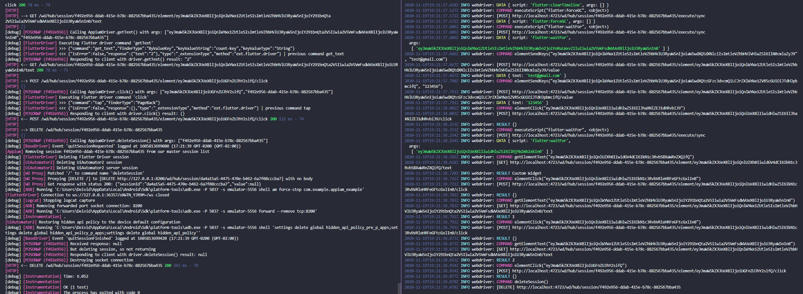

Example of a Flutter project using automated tests with Appium.

>#### $ npm install -g appium
>#### $ appium
>#### $ node index.js android

Ref:
https://github.com/truongsinh/appium-flutter-driver

